# 初中生学习管理系统 - 流程图

## 1. 系统整体流程图

### 1.1 用户学习流程

**流程说明：**
1. 用户登录系统，进行身份验证
2. 验证成功后获取用户信息并加载学习数据
3. 显示学习仪表板，用户可以选择不同的学习模块
4. 用户可以进行学习计划、任务、笔记、作业、练习等操作
5. 学习完成后保存学习记录并更新进度
6. 系统根据进度发送相应的提醒通知

### 1.2 系统架构流程图

**架构说明：**
- **前端应用**：React + TypeScript + Ant Design
- **API网关**：FastAPI路由和中间件
- **微服务**：认证、用户、学习、内容、进度、通知服务
- **数据存储**：PostgreSQL主数据库 + Redis缓存 + 文件存储
- **服务间通信**：HTTP RESTful API

### 1.3 用户角色流程图

**角色说明：**
- **学生用户**：主要使用学习功能模块
- **家长用户**：查看孩子学习进度和任务
- **管理员**：系统管理和数据分析
- **功能模块**：根据角色权限访问不同功能

### 1.4 用户认证流程图

**认证流程：**
1. 用户注册时进行邮箱验证和密码加密
2. 登录时验证密码并生成JWT令牌
3. 后续请求通过令牌验证访问受保护资源
4. 令牌即将过期时自动刷新
5. 用户登出时令牌失效

## 2. 详细业务流程图

### 2.1 学习计划制定流程

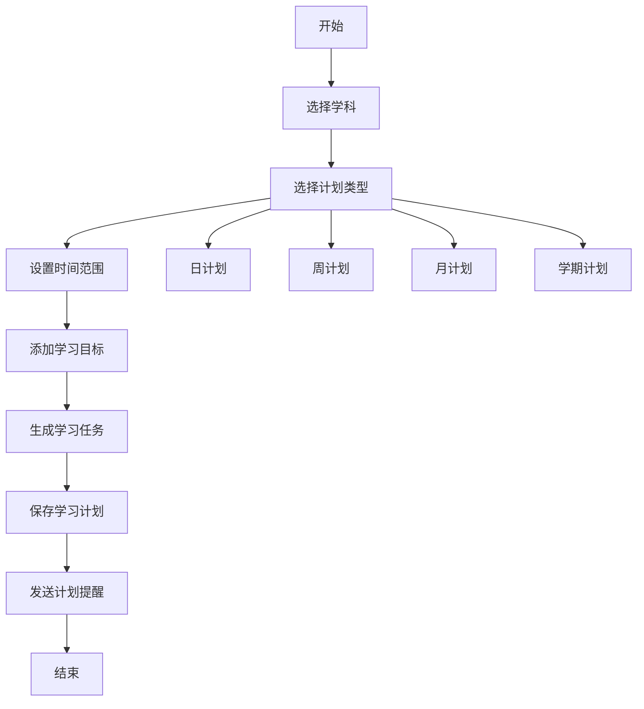
```mermaid
graph TD
    A[开始] --> B[选择学科]
    B --> C[选择计划类型]
    C --> D[设置时间范围]
    D --> E[添加学习目标]
    E --> F[生成学习任务]
    F --> G[保存学习计划]
    G --> H[发送计划提醒]
    H --> I[结束]
    
    C --> C1[日计划]
    C --> C2[周计划]
    C --> C3[月计划]
    C --> C4[学期计划]
```

### 2.2 学习任务执行流程

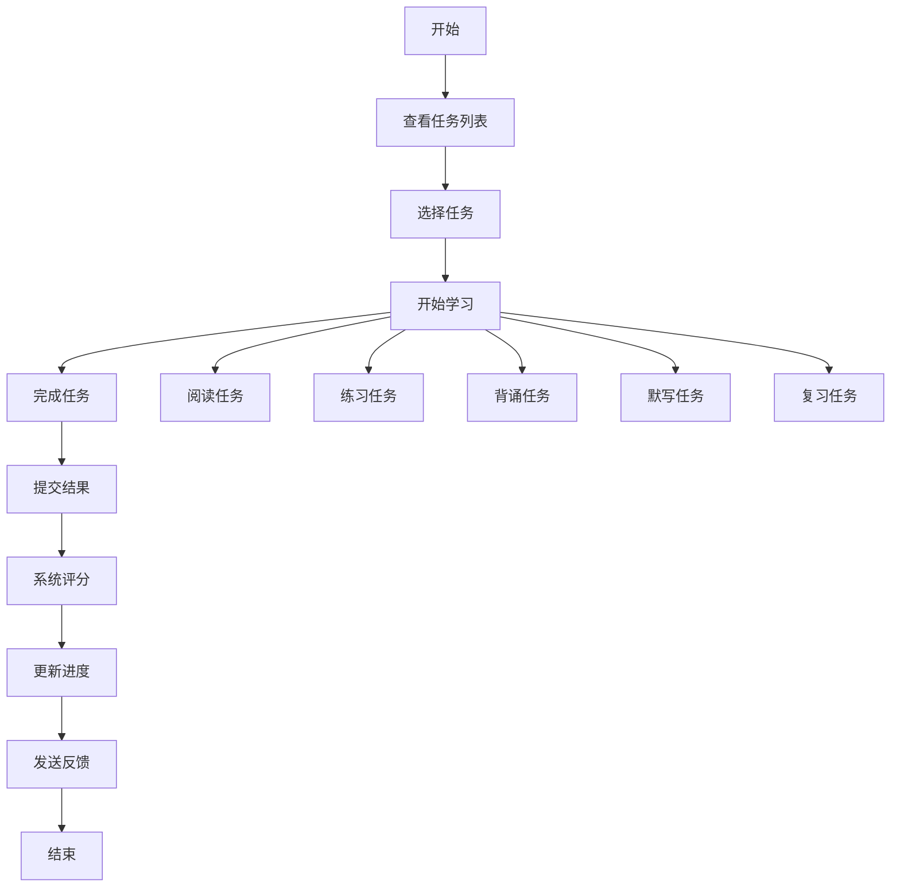
```mermaid
graph TD
    A[开始] --> B[查看任务列表]
    B --> C[选择任务]
    C --> D[开始学习]
    D --> E[完成任务]
    E --> F[提交结果]
    F --> G[系统评分]
    G --> H[更新进度]
    H --> I[发送反馈]
    I --> J[结束]
    
    D --> D1[阅读任务]
    D --> D2[练习任务]
    D --> D3[背诵任务]
    D --> D4[默写任务]
    D --> D5[复习任务]
```

### 2.3 笔记管理流程

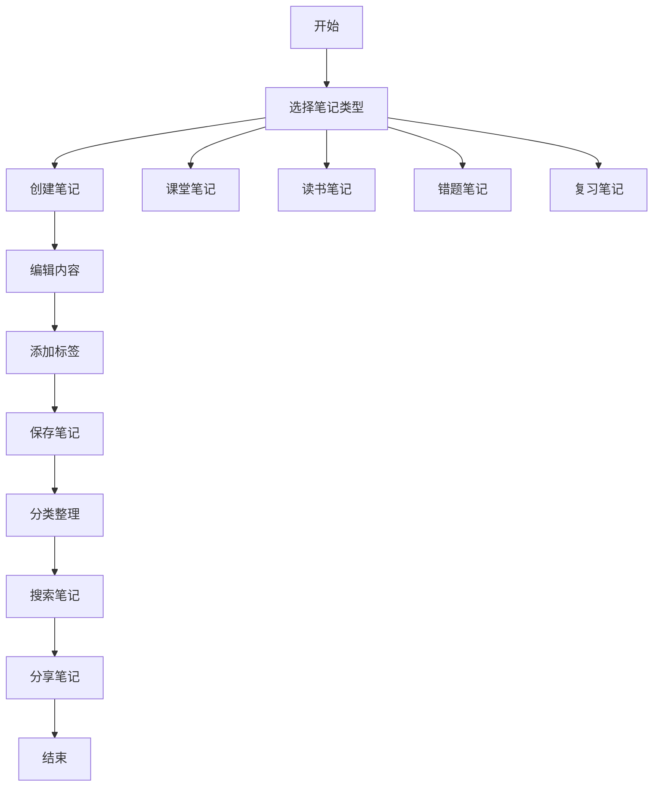
```mermaid
graph TD
    A[开始] --> B[选择笔记类型]
    B --> C[创建笔记]
    C --> D[编辑内容]
    D --> E[添加标签]
    E --> F[保存笔记]
    F --> G[分类整理]
    G --> H[搜索笔记]
    H --> I[分享笔记]
    I --> J[结束]
    
    B --> B1[课堂笔记]
    B --> B2[读书笔记]
    B --> B3[错题笔记]
    B --> B4[复习笔记]
```

### 2.4 作业管理流程

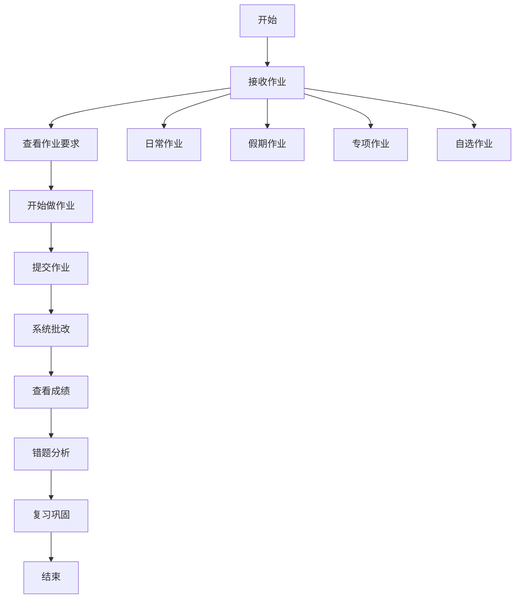
```mermaid
graph TD
    A[开始] --> B[接收作业]
    B --> C[查看作业要求]
    C --> D[开始做作业]
    D --> E[提交作业]
    E --> F[系统批改]
    F --> G[查看成绩]
    G --> H[错题分析]
    H --> I[复习巩固]
    I --> J[结束]
    
    B --> B1[日常作业]
    B --> B2[假期作业]
    B --> B3[专项作业]
    B --> B4[自选作业]
```

### 2.5 练习考试流程

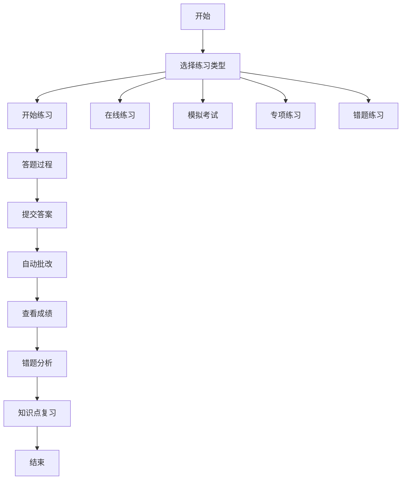
```mermaid
graph TD
    A[开始] --> B[选择练习类型]
    B --> C[开始练习]
    C --> D[答题过程]
    D --> E[提交答案]
    E --> F[自动批改]
    F --> G[查看成绩]
    G --> H[错题分析]
    H --> I[知识点复习]
    I --> J[结束]
    
    B --> B1[在线练习]
    B --> B2[模拟考试]
    B --> B3[专项练习]
    B --> B4[错题练习]
```

## 3. 数据流程图

### 3.1 数据存储流程

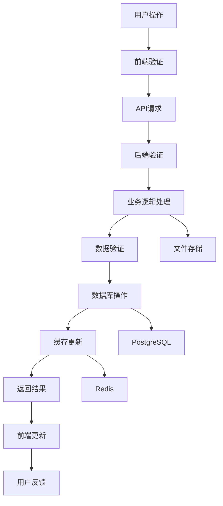
```mermaid
graph TD
    A[用户操作] --> B[前端验证]
    B --> C[API请求]
    C --> D[后端验证]
    D --> E[业务逻辑处理]
    E --> F[数据验证]
    F --> G[数据库操作]
    G --> H[缓存更新]
    H --> I[返回结果]
    I --> J[前端更新]
    J --> K[用户反馈]
    
    G --> G1[PostgreSQL]
    H --> H1[Redis]
    E --> E1[文件存储]
```

### 3.2 数据同步流程

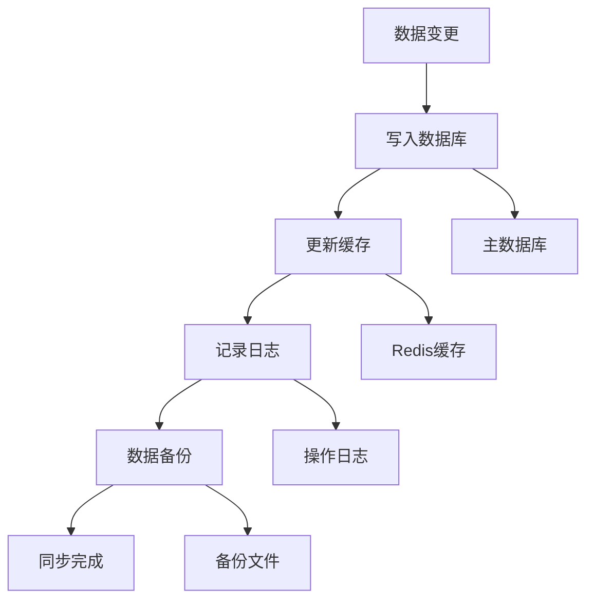
```mermaid
graph TD
    A[数据变更] --> B[写入数据库]
    B --> C[更新缓存]
    C --> D[记录日志]
    D --> E[数据备份]
    E --> F[同步完成]
    
    B --> B1[主数据库]
    C --> C1[Redis缓存]
    D --> D1[操作日志]
    E --> E1[备份文件]
```

## 4. 系统部署流程图

### 4.1 应用部署流程

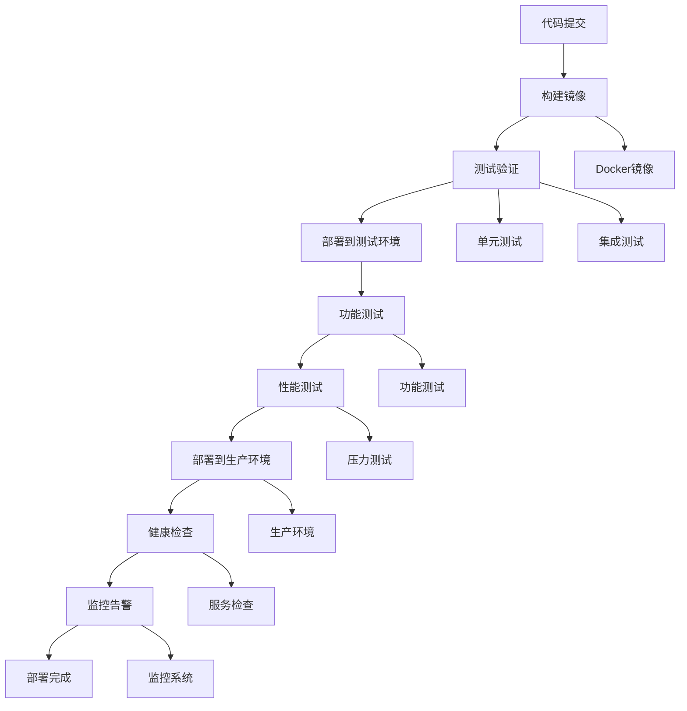
```mermaid
graph TD
    A[代码提交] --> B[构建镜像]
    B --> C[测试验证]
    C --> D[部署到测试环境]
    D --> E[功能测试]
    E --> F[性能测试]
    F --> G[部署到生产环境]
    G --> H[健康检查]
    H --> I[监控告警]
    I --> J[部署完成]
    
    B --> B1[Docker镜像]
    C --> C1[单元测试]
    C --> C2[集成测试]
    E --> E1[功能测试]
    F --> F1[压力测试]
    G --> G1[生产环境]
    H --> H1[服务检查]
    I --> I1[监控系统]
```

### 4.2 数据库迁移流程

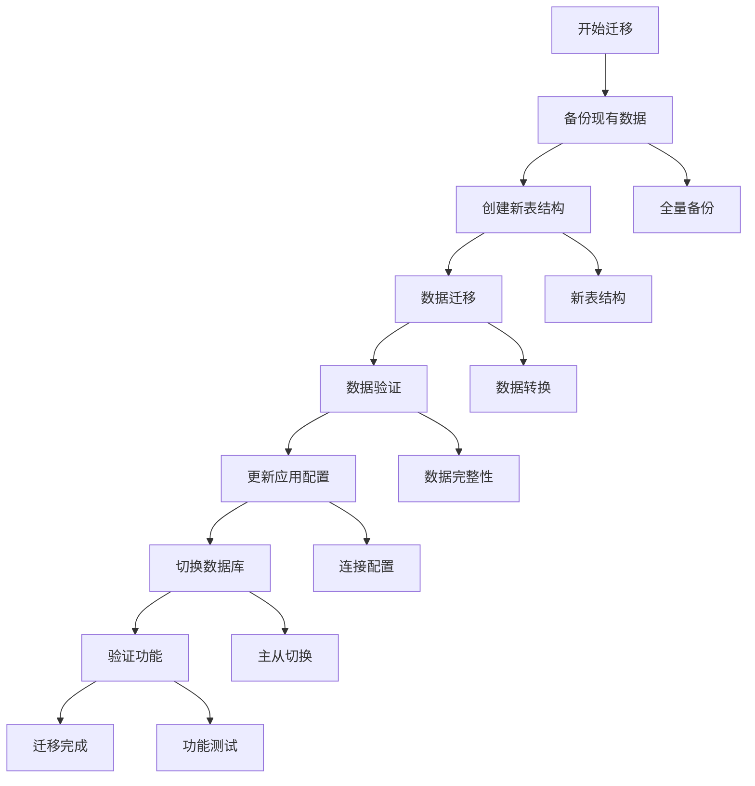
```mermaid
graph TD
    A[开始迁移] --> B[备份现有数据]
    B --> C[创建新表结构]
    C --> D[数据迁移]
    D --> E[数据验证]
    E --> F[更新应用配置]
    F --> G[切换数据库]
    G --> H[验证功能]
    H --> I[迁移完成]
    
    B --> B1[全量备份]
    C --> C1[新表结构]
    D --> D1[数据转换]
    E --> E1[数据完整性]
    F --> F1[连接配置]
    G --> G1[主从切换]
    H --> H1[功能测试]
```

## 5. 错误处理流程图

### 5.1 异常处理流程

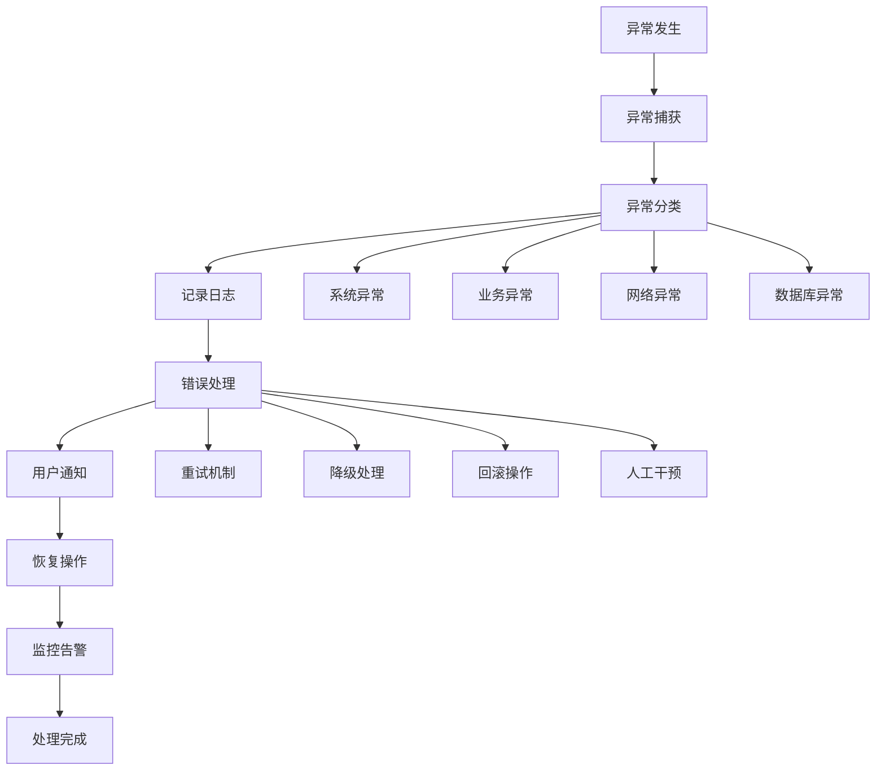
```mermaid
graph TD
    A[异常发生] --> B[异常捕获]
    B --> C[异常分类]
    C --> D[记录日志]
    D --> E[错误处理]
    E --> F[用户通知]
    F --> G[恢复操作]
    G --> H[监控告警]
    H --> I[处理完成]
    
    C --> C1[系统异常]
    C --> C2[业务异常]
    C --> C3[网络异常]
    C --> C4[数据库异常]
    
    E --> E1[重试机制]
    E --> E2[降级处理]
    E --> E3[回滚操作]
    E --> E4[人工干预]
```

### 5.2 故障恢复流程

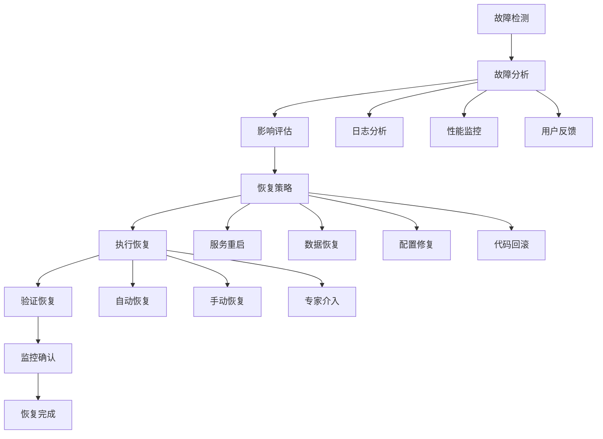
```mermaid
graph TD
    A[故障检测] --> B[故障分析]
    B --> C[影响评估]
    C --> D[恢复策略]
    D --> E[执行恢复]
    E --> F[验证恢复]
    F --> G[监控确认]
    G --> H[恢复完成]
    
    B --> B1[日志分析]
    B --> B2[性能监控]
    B --> B3[用户反馈]
    
    D --> D1[服务重启]
    D --> D2[数据恢复]
    D --> D3[配置修复]
    D --> D4[代码回滚]
    
    E --> E1[自动恢复]
    E --> E2[手动恢复]
    E --> E3[专家介入]
```

## 6. 监控告警流程图

### 6.1 监控数据收集流程

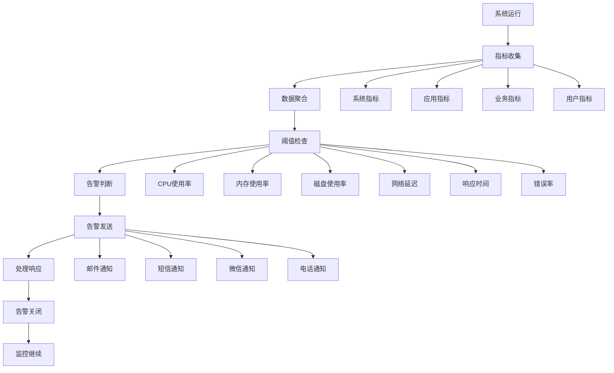
```mermaid
graph TD
    A[系统运行] --> B[指标收集]
    B --> C[数据聚合]
    C --> D[阈值检查]
    D --> E[告警判断]
    E --> F[告警发送]
    F --> G[处理响应]
    G --> H[告警关闭]
    H --> I[监控继续]
    
    B --> B1[系统指标]
    B --> B2[应用指标]
    B --> B3[业务指标]
    B --> B4[用户指标]
    
    D --> D1[CPU使用率]
    D --> D2[内存使用率]
    D --> D3[磁盘使用率]
    D --> D4[网络延迟]
    D --> D5[响应时间]
    D --> D6[错误率]
    
    F --> F1[邮件通知]
    F --> F2[短信通知]
    F --> F3[微信通知]
    F --> F4[电话通知]
```

## 7. 安全防护流程图

### 7.1 安全检测流程

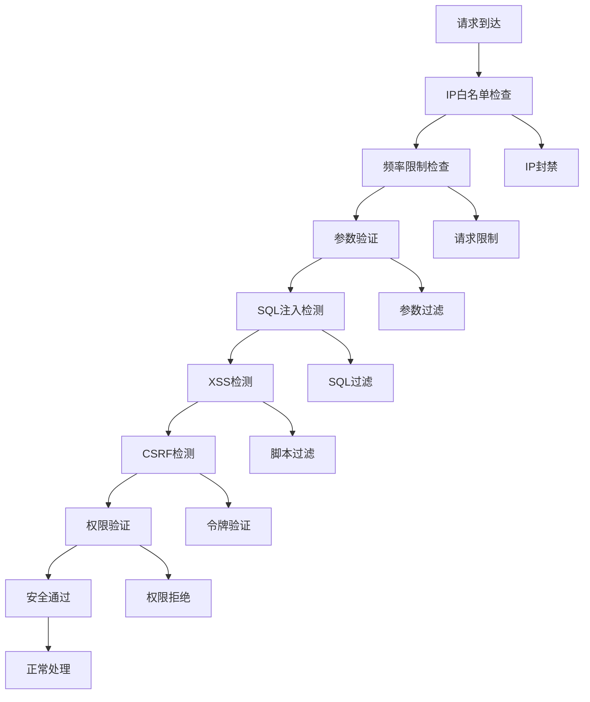
```mermaid
graph TD
    A[请求到达] --> B[IP白名单检查]
    B --> C[频率限制检查]
    C --> D[参数验证]
    D --> E[SQL注入检测]
    E --> F[XSS检测]
    F --> G[CSRF检测]
    G --> H[权限验证]
    H --> I[安全通过]
    I --> J[正常处理]
    
    B --> B1[IP封禁]
    C --> C1[请求限制]
    D --> D1[参数过滤]
    E --> E1[SQL过滤]
    F --> F1[脚本过滤]
    G --> G1[令牌验证]
    H --> H1[权限拒绝]
```

### 7.2 数据安全流程

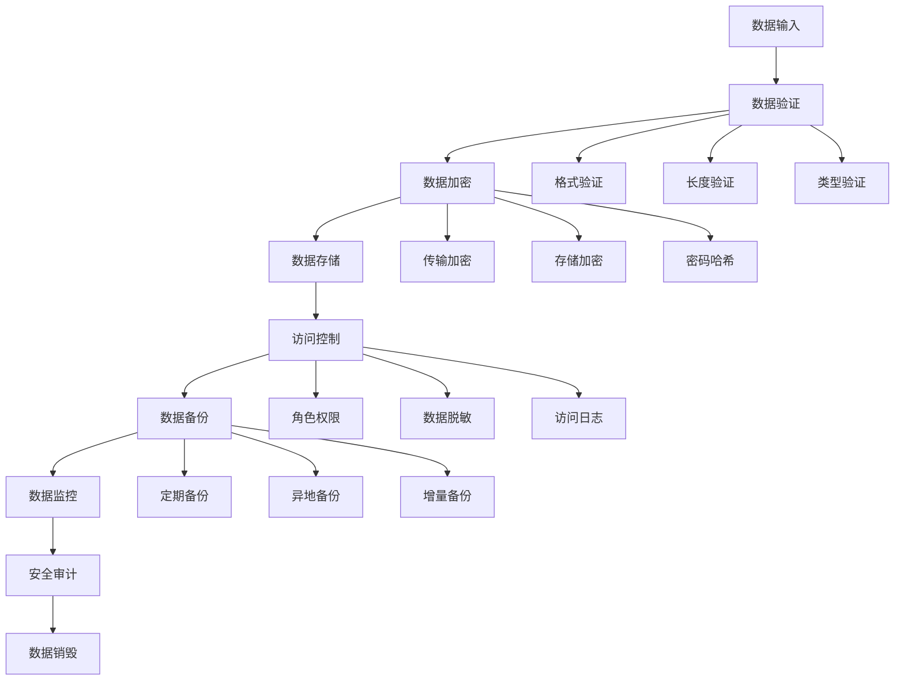
```mermaid
graph TD
    A[数据输入] --> B[数据验证]
    B --> C[数据加密]
    C --> D[数据存储]
    D --> E[访问控制]
    E --> F[数据备份]
    F --> G[数据监控]
    G --> H[安全审计]
    H --> I[数据销毁]
    
    B --> B1[格式验证]
    B --> B2[长度验证]
    B --> B3[类型验证]
    
    C --> C1[传输加密]
    C --> C2[存储加密]
    C --> C3[密码哈希]
    
    E --> E1[角色权限]
    E --> E2[数据脱敏]
    E --> E3[访问日志]
    
    F --> F1[定期备份]
    F --> F2[异地备份]
    F --> F3[增量备份]
```

## 8. 性能优化流程图

### 8.1 缓存策略流程

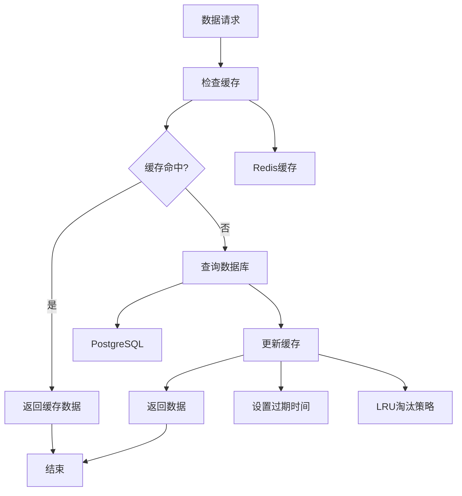
```mermaid
graph TD
    A[数据请求] --> B[检查缓存]
    B --> C{缓存命中?}
    C -->|是| D[返回缓存数据]
    C -->|否| E[查询数据库]
    E --> F[更新缓存]
    F --> G[返回数据]
    D --> H[结束]
    G --> H
    
    B --> B1[Redis缓存]
    E --> E1[PostgreSQL]
    F --> F1[设置过期时间]
    F --> F2[LRU淘汰策略]
```

### 8.2 数据库优化流程

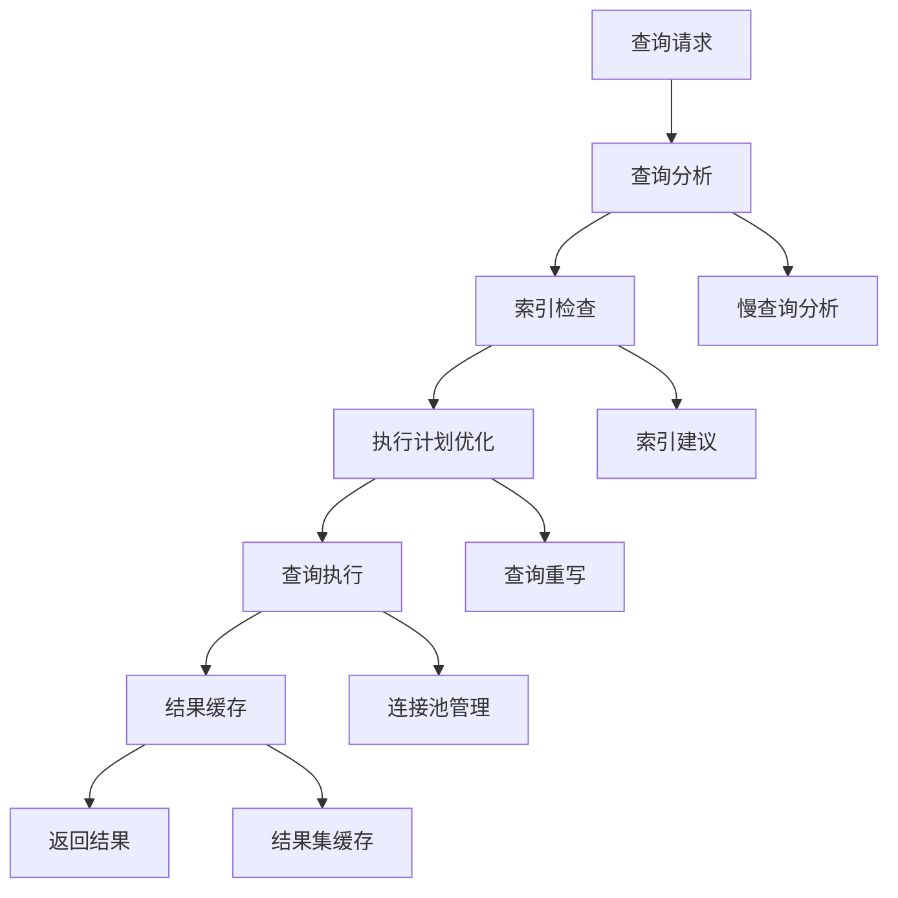
```mermaid
graph TD
    A[查询请求] --> B[查询分析]
    B --> C[索引检查]
    C --> D[执行计划优化]
    D --> E[查询执行]
    E --> F[结果缓存]
    F --> G[返回结果]
    
    B --> B1[慢查询分析]
    C --> C1[索引建议]
    D --> D1[查询重写]
    E --> E1[连接池管理]
    F --> F1[结果集缓存]
```

## 9. 总结

本流程图文档详细描述了初中生学习管理系统的各种业务流程，包括：

1. **系统整体流程**：用户学习、系统架构、用户角色、认证流程
2. **详细业务流程**：学习计划、任务执行、笔记管理、作业管理、练习考试
3. **数据流程**：数据存储、数据同步
4. **部署流程**：应用部署、数据库迁移
5. **错误处理**：异常处理、故障恢复
6. **监控告警**：监控数据收集
7. **安全防护**：安全检测、数据安全
8. **性能优化**：缓存策略、数据库优化

这些流程图为系统的开发、部署、维护和优化提供了清晰的指导，确保系统能够稳定、高效、安全地运行。
